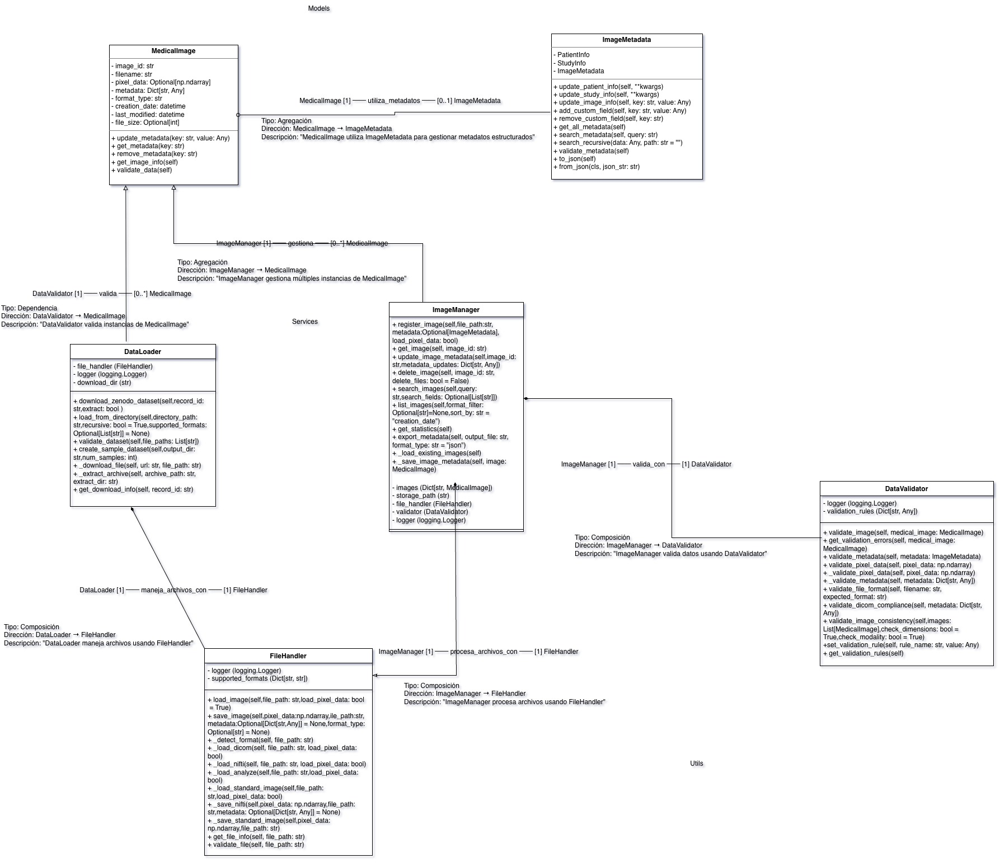

# Medical Image Metadata Manager (Group 4 Final Project)



*Figure: Class diagram (diagramClass.jpg)*

## Summary

This project is a lightweight metadata manager for medical images. It allows loading, validating, and managing metadata associated with images (for example, NIfTI files or other formats) through a modular structure composed of models, services, and utilities.

The README assumes there is a class diagram named `diagramClass.jpg` that describes the relationships between the main classes — below is an interpretation and mapping to the existing code.

## Main components (mapping to the class diagram)

- `models.medical_image` (class: MedicalImage)
  - Represents a medical image and its associated metadata.
  - Expected attributes: id/uuid, path/filename, modality, dimensions, metadata (dictionary).
  - Typical methods: from_file, to_dict, validate.

- `models.metadata` (class: Metadata)
  - Encapsulates the metadata structure (fields, validations, and transformations).

- `services.data_loader` (class/functions: DataLoader)
  - Responsible for reading metadata files from disk (`data/images/`), parsing JSON and producing model objects.

- `services.image_manager` (class: ImageManager)
  - High-level API for CRUD operations over metadata and images — find, update, delete, batch-validate.

- `utils.file_handler` (I/O helpers)
  - Safe file read/write helpers, path handling and existence checks.

- `utils.validators` (validators)
  - Rules to ensure metadata integrity (e.g., required fields, formats, types).

## Typical flow

1. The `DataLoader` scans `data/images/` looking for files that end with `_metadata.json`.
2. Each JSON file is parsed and mapped to a `MedicalImage` object (contains `Metadata`).
3. `ImageManager` can apply validations from `validators` and use `file_handler` to persist changes.

## File structure

- `main.py` — a simple entrypoint (script) to run ad-hoc operations.
- `medical_image_manager/` — main package with models and services.
  - `models/medical_image.py` — definition of the Image entity.
  - `models/metadata.py` — metadata structure/validation.
  - `services/data_loader.py` — file loading from `data/`.
  - `services/image_manager.py` — management functions (create, read, update, delete, validate).
- `utils/` — supporting utilities.
  - `file_handler.py` — helpers to read/write JSON.
  - `validators.py` — field validation.
- `data/images/` — example folder with metadata JSON files.
- `tests/` — basic unit tests.

## Requirements

- Python 3.8+ (recommended 3.10+)
- Dependencies listed in `requirements.txt`.

Quick install (macOS, zsh):

```bash
# create and activate a virtual environment (optional but recommended)
python3 -m venv .venv
source .venv/bin/activate

# install dependencies
pip install -r requirements.txt
```

## Usage

Run the main script for a basic demonstration:

```bash
python main.py
```

By default the application is configured to read metadata from `data/images/`. You can modify or add `_metadata.json` files in that folder to test loading and validation.

## Tests

Run the unit tests with:

```bash
python -m pytest -q
```

## Minimal contract (inputs/outputs)

- Input: JSON files in `data/images/` containing metadata per image.
- Output: `MedicalImage` objects in memory and updated JSON files when changes are persisted.
- Errors: Failed validations (missing field / wrong type) raise controlled exceptions (ValueError or validation-specific classes).

## Assumptions

- The class diagram image `Diagrama de clases.jpg` is included in the repository and embedded above. The README interpretation maps to that diagram; if you want exact text changes to align with a different diagram file, provide it and I'll update the mapping.
- I assumed common naming conventions for methods and attributes (from_file, to_dict, id/uuid). If the actual implementation differs I can synchronize the README after reviewing the code.

## Notes and next steps

- If you want, I can:
  - Embed the class diagram image in the README (upload `diagram de class.jpg`).
  - Add more detailed usage examples (snippets) showing concrete calls to `ImageManager`.
  - Expand tests with more validation cases.

---

If you want me to include the diagram image or adapt the documentation to a different style or language, tell me and I'll update it.